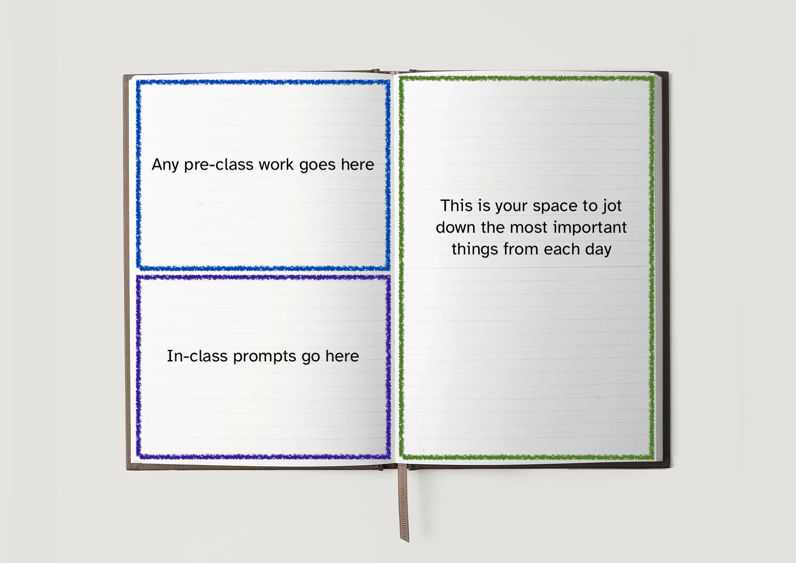

```{r setup, include=FALSE}
library(fontawesome)
```

Page 1: Leave blank for name/table of contents

After page 1, each course day will get two pages in "booklet style" 
    - Left, top: Prep/pre-work for the day (answer my question or jot down your own question, can be left blank)
    - Left, bottom: reflections from in-class prompt
    - Right: your space to summarize the main points for the day



# Table of Contents

- p2-3: Fill in at some point with `ggplot` and data visualization notes
- p4-5: In-class: what is an example of data that would work well for a choropleth map? What about a proportional symbol map?
- p5-6: In class: what aspects of a graph made writing alt-text hard/easy? what aspects of an alt-text description made recreating the graph harder or easier?

