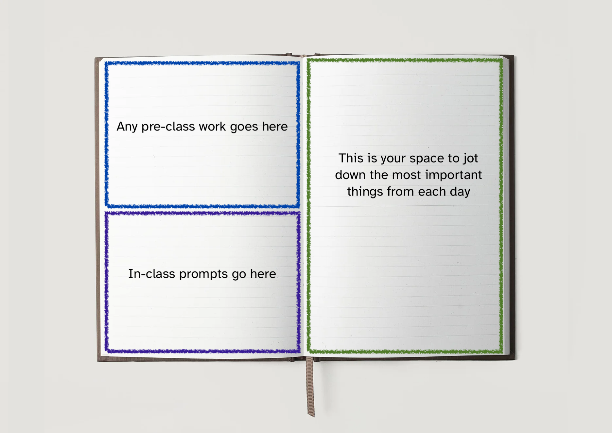
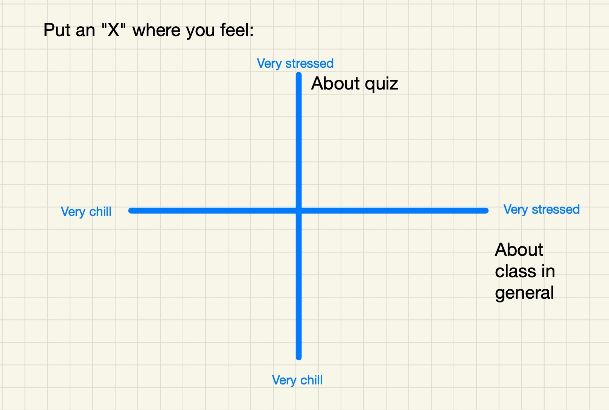

```{r setup, include=FALSE}
library(fontawesome)
```

Page 1: Leave blank for name/table of contents

After page 1, each course day will get two pages in "booklet style" 
    - Left, top: Prep/pre-work for the day (answer my question or jot down your own question, can be left blank)
    - Left, bottom: reflections from in-class prompt
    - Right: your space to summarize the main points for the day



# Table of Contents

*Note:* if you deviate from this ToC, that's perfectly fine! Just please keep your first page updated with what your ToC follows so I can find what I'm looking for

- Day4 | p2-3: Fill in at some point with `ggplot` and data visualization notes
- Day5 | p4-5: In-class: what is an example of data that would work well for a choropleth map? What about a proportional symbol map?
- Day6| p5-6: In class: what aspects of a graph made writing alt-text hard/easy? what aspects of an alt-text description made recreating the graph harder or easier?
- Day7 | p7-8: put an "X" where you currently feel about the quiz/class in general

{fig-alt="A blank graph with lab quiz on the y-axis and class in general on the x-axis. Negative values correspond to very chill and positive values correspond to very stressed."}

- Day8 | p9-10: Sketch the tidy version of the `bakeoff` dataset (see the original prompt in [slides09](https://stat220-f26.github.io/slides/08/slides08.html#/discuss))

- Day9: Quiz01! No journal entry

- Day10| p11-12: After completing the last prompt in the activity, tell me which dessert you would most like to sample from the list

- Day11 | p13-14: Sketch what the first 3 rows of `cafe_orders.csv` look like as raw text, then sketch the data frame R builds from it. Circle one place where the two don't match. What did R guess wrong, and which argument (col_types, na, format) would you use to fix it?

